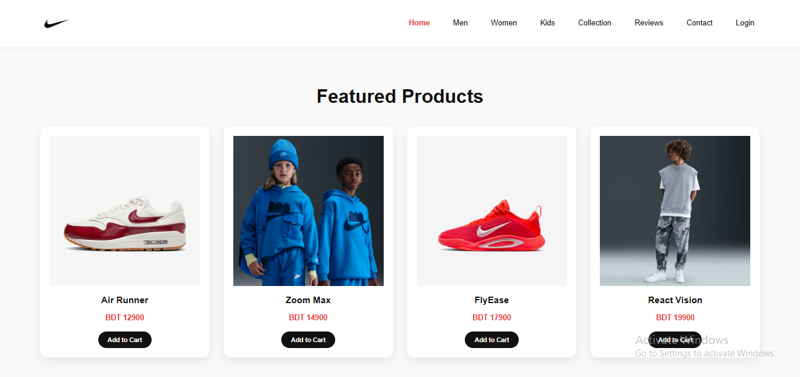
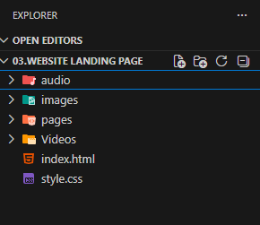
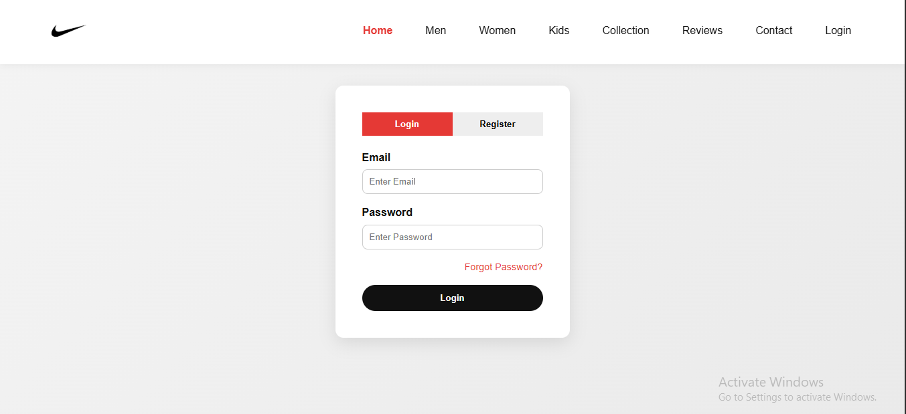
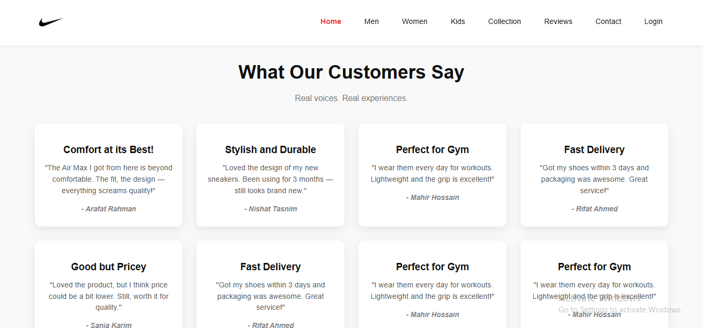
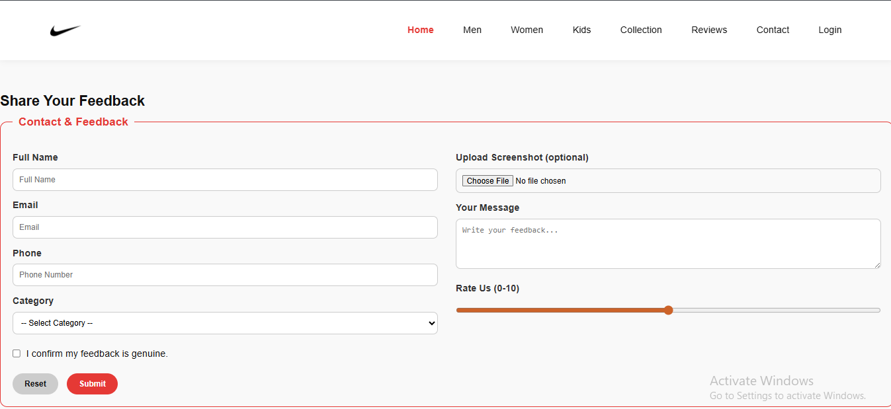

# Footwear Collection - E-Commerce Landing Page

## Project Overview
This repository contains the frontend implementation of a highly responsive e-commerce landing page for a footwear brand (Nike-inspired). The primary focus of this project was to translate UI/UX design concepts into a fully functional web interface using core web technologies, completely independently of external CSS frameworks. 

This project demonstrates proficiency in modern web design principles, semantic markup, and advanced styling techniques required for building scalable and interactive user interfaces.

## Project Structure
The project maintains a clean and organized directory structure for managing assets and web pages efficiently:

## Featured UI Design

## Additional Features & Pages
Beyond the main landing page, the project includes several fully styled, responsive internal pages to complete the e-commerce experience:

### Login & Registration
A clean, modern authentication interface with interactive tab switching.

### Customer Reviews
A dynamic grid layout showcasing customer feedback with premium hover effects and card styling.

### Contact, Feedback & Store Locator
A comprehensive contact section featuring advanced form controls (dropdowns, range sliders, file uploads) and an embedded interactive Google Map.

## Technical Highlights & Implementations
To ensure optimal performance, maintainability, and cross-device compatibility, the following techniques were implemented:

* **Modern Layout Systems:** Utilized advanced CSS Grid and Flexbox to construct complex, fluid layouts that adapt seamlessly to diverse screen sizes (Mobile, Tablet, Desktop).
* **Interactive UI Animations:** Engineered custom CSS `@keyframes` animations (e.g., dynamic typing effects, pulsing buttons, and bouncing scroll indicators) to enhance user engagement without relying on JavaScript.
* **CSS-Only Mobile Navigation:** Implemented a responsive hamburger menu for mobile viewports using the advanced CSS Checkbox Hack, demonstrating creative problem-solving with pure CSS.
* **Multimedia Integration:** Successfully integrated HTML5 video attributes for auto-playing, muted hero section backgrounds to create a premium visual experience.
* **Advanced Styling:** Applied modern CSS features including linear gradients, webkit text-clipping, custom form inputs, and box-shadows to build a modern, aesthetic user interface.

## Technology Stack
* **Markup Language:** HTML5 (Semantic Structure)
* **Styling Language:** CSS3 (Grid, Flexbox, Media Queries, Keyframes)
